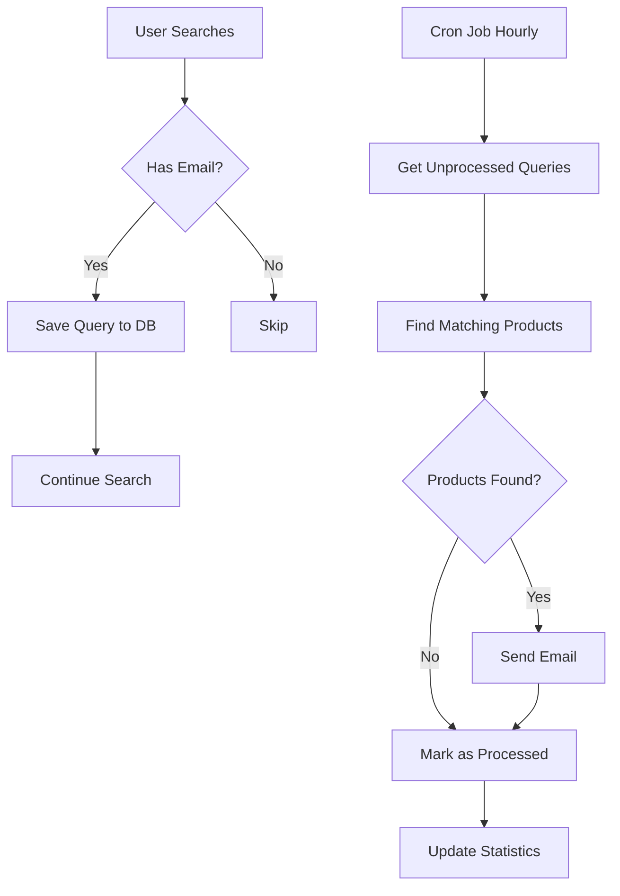

# 🔔 Search Alerts System

## Overview

A comprehensive search alert system that automatically captures user search queries and sends email notifications when new matching products are posted. Built with Node.js, Express, MongoDB (Prisma), and Nodemailer.

## 🌟 Features

### Core Functionality
✅ **Automatic Query Capture** - Captures all searches from authenticated users  
✅ **Smart Product Matching** - Matches products by title, description, and filters  
✅ **Email Notifications** - Beautiful HTML emails with product details  
✅ **Scheduled Processing** - Hourly cron job with configurable intervals  
✅ **Admin Control Panel** - Full control via REST API  
✅ **Rate Limiting** - Per-user email limits to prevent spam  
✅ **Template System** - Customizable email templates with variables  
✅ **Statistics & Analytics** - Track queries, users, and trends  
✅ **Test Email Functionality** - Test templates before going live  
✅ **Automatic Cleanup** - Remove old processed queries  

### Technical Features
- Non-blocking query storage (doesn't slow down search)
- Graceful SMTP error handling
- Optimized database indexes
- Production-ready cron scheduling
- Template variable system
- Filter preservation (category, location, price)
- Only new products (last 24 hours)
- Responsive email design

## 📁 Project Structure

```
backend/
├── prisma/
│   └── schema.prisma                    # Database models (SearchQuery, SearchAlertSettings)
├── services/
│   └── searchAlerts.js                  # Core service (processing, emails, matching)
├── routes/
│   ├── search.js                        # Updated with query capture
│   └── search-alerts.js                 # Admin API endpoints
├── utils/
│   └── cron.js                          # Cron job setup (hourly processing)
├── scripts/
│   └── init-search-alerts.js            # Initialize default settings
├── server.js                            # Updated with route + cron initialization
├── SEARCH_ALERTS_SETUP.md               # Complete documentation
├── SEARCH_ALERTS_QUICKSTART.md          # Quick setup guide
├── MIGRATION_INSTRUCTIONS.md            # Step-by-step migration guide
├── ADMIN_PANEL_EXAMPLE.tsx              # Frontend admin component example
└── SEARCH_ALERTS_README.md              # This file
```

## 🚀 Quick Start

### Prerequisites
- Node.js (v14+)
- PostgreSQL database
- SMTP server access (Gmail, SendGrid, etc.)
- Prisma CLI installed

### Installation

**1. Run Database Migration** (⚠️ Server must be stopped)
```powershell
cd D:\sellit\backend
npx prisma migrate dev --name add_search_alerts
npx prisma generate
```

**2. Initialize Settings**
```powershell
npm run init-search-alerts
```

**3. Configure SMTP** (`.env`)
```env
SMTP_HOST=smtp.gmail.com
SMTP_PORT=587
SMTP_USER=your-email@gmail.com
SMTP_PASS=your-app-password
FRONTEND_URL=http://localhost:3000
```

**4. Start Server**
```powershell
npm run dev
```

✅ Done! System is now active.

## 📊 How It Works



### Flow Details

1. **Query Capture Phase**
   - User performs search on frontend
   - If logged in with email → Query saved to database
   - Search results returned immediately (non-blocking)

2. **Processing Phase** (Every Hour)
   - Cron job checks for unprocessed queries
   - Filters queries within configured time window
   - Groups queries by user email
   - Respects per-user email limits

3. **Matching Phase**
   - Searches for products matching query text
   - Applies original filters (category, location, price)
   - Only includes products from last 24 hours
   - Limits to 10 products per alert

4. **Email Phase**
   - Generates HTML email from template
   - Replaces template variables
   - Sends via SMTP
   - Marks query as processed
   - Updates statistics

## 🔧 Configuration

### Settings (Configurable via Admin API)

| Setting | Default | Description |
|---------|---------|-------------|
| `enabled` | `true` | Enable/disable entire system |
| `maxEmailsPerUser` | `5` | Max alerts per user per check |
| `checkIntervalHours` | `24` | Time window for processing queries |
| `emailSubject` | See defaults | Email subject line |
| `emailBody` | See defaults | HTML email template |

### Template Variables

| Variable | Description | Example |
|----------|-------------|---------|
| `{{query}}` | User's search query | "iPhone 13" |
| `{{products}}` | Formatted product HTML list | (HTML) |
| `{{count}}` | Number of products found | "5" |

### Cron Schedule

- **Every Hour**: `0 * * * *` - Process search alerts
- **On Startup**: 30 seconds after server starts - Initial check
- **Daily 2 AM**: `0 2 * * *` - Account cleanup (existing)

## 📡 API Endpoints

### Admin Endpoints (Require Admin Role)

#### Get Settings
```http
GET /api/search-alerts/settings
Authorization: Bearer <admin-token>
```

**Response:**
```json
{
  "success": true,
  "settings": {
    "id": "...",
    "enabled": true,
    "maxEmailsPerUser": 5,
    "checkIntervalHours": 24,
    "emailSubject": "...",
    "emailBody": "..."
  }
}
```

#### Update Settings
```http
PUT /api/search-alerts/settings
Authorization: Bearer <admin-token>
Content-Type: application/json

{
  "enabled": true,
  "maxEmailsPerUser": 10,
  "emailSubject": "New products for you!"
}
```

#### Get Statistics
```http
GET /api/search-alerts/statistics
Authorization: Bearer <admin-token>
```

**Response:**
```json
{
  "success": true,
  "statistics": {
    "totalQueries": 1250,
    "processedQueries": 1100,
    "pendingQueries": 150,
    "uniqueUsers": 45,
    "queriesLast7Days": 230,
    "topQueries": [
      { "query": "iPhone", "count": 45 },
      { "query": "Laptop", "count": 32 }
    ]
  }
}
```

#### Get Recent Queries
```http
GET /api/search-alerts/queries?page=1&limit=20&processed=false
Authorization: Bearer <admin-token>
```

#### Cleanup Old Queries
```http
DELETE /api/search-alerts/queries/cleanup?days=30
Authorization: Bearer <admin-token>
```

#### Test Email
```http
POST /api/search-alerts/test-email
Authorization: Bearer <admin-token>
Content-Type: application/json

{
  "email": "test@example.com",
  "testQuery": "iPhone 13"
}
```

## 🎨 Email Template Example

```html
<p>Hi there!</p>
<p>We found some exciting products matching your recent search: <strong>{{query}}</strong></p>
<p>Here are {{count}} products you might be interested in:</p>

{{products}}

<p>
  <a href="http://localhost:3000" style="...">
    Browse More Products
  </a>
</p>
```

The `{{products}}` variable is automatically replaced with:
- Product image
- Title (linked)
- Description (truncated)
- Price (formatted)
- Location
- "View Product" button

## 🧪 Testing

### 1. Test SMTP Configuration
```bash
curl -X POST http://localhost:5000/api/search-alerts/test-email \
  -H "Authorization: Bearer YOUR_ADMIN_TOKEN" \
  -H "Content-Type: application/json" \
  -d '{"email":"test@example.com","testQuery":"test"}'
```

### 2. Test Query Capture
1. Login as user with email
2. Search: http://localhost:3000/search?q=test
3. Check database:
   ```sql
   SELECT * FROM "SearchQuery" ORDER BY "createdAt" DESC;
   ```

### 3. Manual Trigger
Restart server to trigger immediate processing (runs after 30 seconds)

### 4. Check Logs
```
🔍 Starting search alerts processing...
📊 Found 5 unprocessed search queries
✅ Search alert email sent to: user@example.com
✅ Search alerts processing complete: 3 emails sent, 5 queries processed
```

## 🐛 Troubleshooting

### Emails Not Sending

**Check SMTP Configuration:**
```
📧 Checking SMTP configuration...
   SMTP_HOST: ✅ Set
   SMTP_USER: ✅ Set
   SMTP_PASS: ✅ Set (hidden)
```

**Common Issues:**
- Wrong SMTP credentials
- Gmail security blocking (use App Password)
- Port blocked by firewall
- SMTP server down

**Solution:**
1. Test with test email endpoint
2. Check server logs for errors
3. Verify Gmail App Password setup

### Queries Not Being Saved

**Requirements:**
- User must be logged in
- User must have email address
- Search must have query text (not empty)

**Debug:**
```javascript
// Check in routes/search.js
console.log('User:', req.user);
console.log('Email:', req.user?.email);
```

### Migration Issues

**Error: File locked**
- Stop server completely
- Wait 10 seconds
- Run migration again

**Error: Shadow database**
```powershell
npx prisma migrate reset
npx prisma migrate dev
```

## 📈 Performance

### Database Indexes
Optimized indexes for fast queries:
- `userId` - User lookups
- `userEmail` - Email filtering  
- `processed` - Pending query selection
- `createdAt` - Time-based filtering

### Non-Blocking Design
- Query storage is asynchronous
- Doesn't slow down search API
- Cron runs in background
- Graceful error handling

### Resource Usage
- Minimal memory footprint
- Efficient database queries
- Batch processing
- Automatic cleanup

## 🔐 Security

### Authentication
- Admin endpoints require admin role
- JWT token validation
- User email validation

### Rate Limiting
- Per-user email limits
- Configurable intervals
- Prevents spam

### Data Privacy
- Only captures logged-in user searches
- Email addresses required
- GDPR-compliant deletion

## 🛠️ Maintenance

### Regular Tasks

**Weekly:**
- Review statistics
- Check top queries for insights

**Monthly:**
- Cleanup old queries (30+ days)
- Review email templates
- Check SMTP logs

**Quarterly:**
- Database optimization
- Performance review
- Update email templates

### Monitoring

**Key Metrics:**
- Pending queries count
- Email success rate
- Top searched queries
- Unique active users

**Health Checks:**
```bash
# Check pending queries
SELECT COUNT(*) FROM "SearchQuery" WHERE processed = false;

# Check settings
SELECT * FROM search_alert_settings;

# Check recent activity
SELECT DATE("createdAt"), COUNT(*) 
FROM "SearchQuery" 
GROUP BY DATE("createdAt") 
ORDER BY DATE("createdAt") DESC 
LIMIT 7;
```

## 📚 Documentation Files

| File | Purpose |
|------|---------|
| `SEARCH_ALERTS_SETUP.md` | Complete technical documentation |
| `SEARCH_ALERTS_QUICKSTART.md` | 5-minute setup guide |
| `MIGRATION_INSTRUCTIONS.md` | Detailed migration steps |
| `ADMIN_PANEL_EXAMPLE.tsx` | Frontend admin component |
| `SEARCH_ALERTS_README.md` | This overview file |

## 🎯 Use Cases

1. **E-commerce**
   - Alert buyers when products they searched for are posted
   - Increase engagement and sales

2. **Classifieds**
   - Notify users of new listings matching their interests
   - Reduce time to first purchase

3. **Marketplace**
   - Keep users informed about relevant products
   - Improve user retention

4. **Analytics**
   - Understand what users are searching for
   - Identify trending products
   - Optimize inventory

## 🚀 Future Enhancements

Potential improvements:

- [ ] User opt-in/opt-out preferences
- [ ] Per-user alert frequency settings
- [ ] Category-specific subscriptions
- [ ] Price drop alerts
- [ ] Daily digest emails
- [ ] Push notification integration
- [ ] ML-based product matching
- [ ] Advanced analytics dashboard
- [ ] A/B testing for email templates
- [ ] Multi-language support

## 📞 Support

For issues:
1. Check logs for errors
2. Review troubleshooting section
3. Test with test email endpoint
4. Verify database migration
5. Check SMTP configuration

## 📄 License

Part of the SellIt platform. All rights reserved.

## 🤝 Contributing

Internal project. Contact development team for contributions.

---

## ✅ Checklist

Before going to production:

- [ ] Database migration completed
- [ ] SMTP configured and tested
- [ ] Default settings initialized
- [ ] Test email sent successfully
- [ ] Admin panel integrated
- [ ] Cron jobs running
- [ ] Logs monitored
- [ ] Email templates reviewed
- [ ] User limits configured
- [ ] Statistics working
- [ ] Cleanup scheduled
- [ ] Documentation reviewed

---

**Version:** 1.0.0  
**Last Updated:** December 3, 2024  
**Status:** ✅ Production Ready

